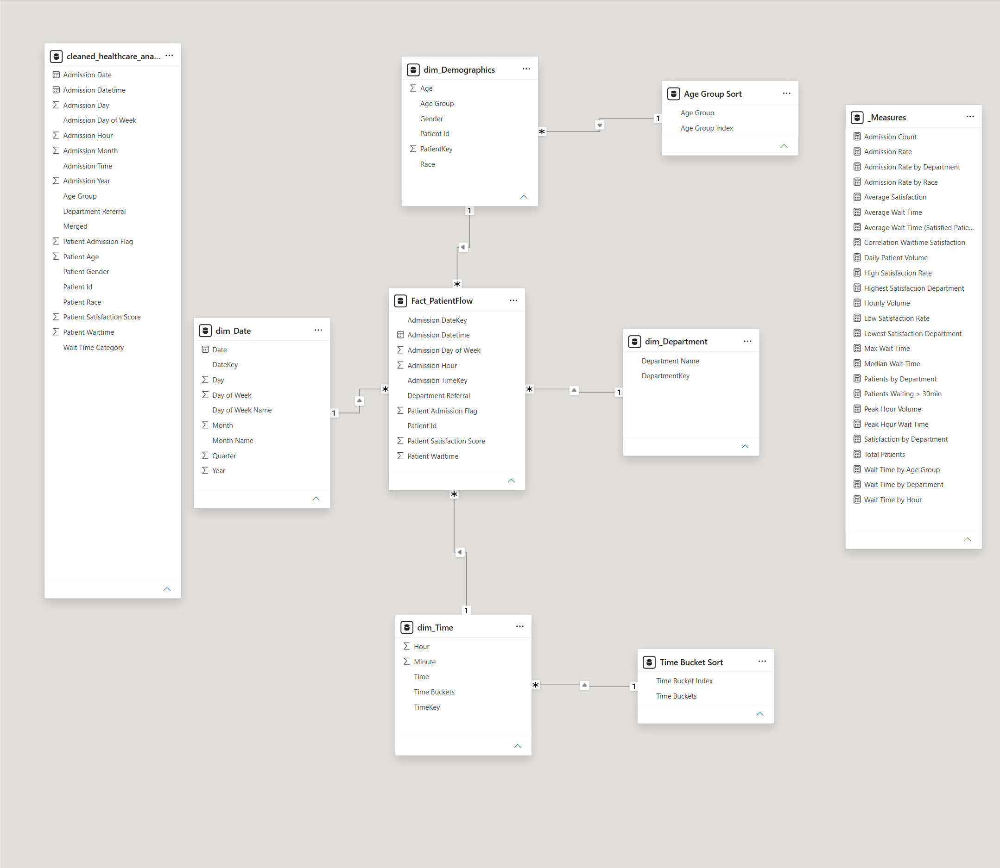

# Healthcare Throughput & Patient Flow Analysis
A data-driven operational intelligence project analyzing patient flow, wait times, satisfaction, and departmental performance using Python and Power BI.

## 📄 Full Case Study (PDF)
[Download the Case Study](Healthcare%20Throughput%20Case%20Study.pdf)

## 📁 Power BI Source File
[Download the full interactive Power BI report (.pbix)](/dashboard/Healthcare%Throughput.pbix)

---

## 📊 Dashboard Preview

**Page 1 — Patient Flow Overview**  

**Page 2 — Operational Bottlenecks & Throughput**  

**Page 3 — Patient Experience & Satisfaction Analysis**  

**Available Filters**  

---

## 🧩 Data Model (Schema)
The Power BI data model structures the cleaned dataset into a star-schema optimized for analytical performance and DAX calculations.

**Power BI Data Model (Star Schema)**

---

## 🧠 Project Overview
This project analyzes patient throughput, wait times, satisfaction, and departmental performance using a real-world healthcare operations dataset. The goal is to identify bottlenecks, quantify their operational impact, and provide actionable recommendations to improve service delivery.

---

## 🔍 Key Insights
- Peak congestion occurs between **10 AM–2 PM**
- Average wait time is **35.3 minutes**
- Satisfaction drops sharply after **30 minutes**
- High-wait departments include **Neurology, Physiotherapy, Gastroenterology**
- Admission rate is **50%**, with Renal highest at **53%**

---

## 🔄 Workflow Diagram
        ┌──────────────────────┐
        │   Raw Dataset (CSV)  │
        └──────────┬───────────┘
                   │
                   ▼
        ┌──────────────────────┐
        │   Python (EDA)       │
        │ - Data Cleaning      │
        │ - Feature Engineering│
        │ - EDA                │
        └──────────┬───────────┘
                   │
                   ▼
        ┌──────────────────────┐
        │  Cleaned Dataset     │
        │   (Exported CSV)     │
        └──────────┬───────────┘
                   │
                   ▼
        ┌──────────────────────┐
        │ Power BI Data Model  │
        │ - Relationships      │
        │ - DAX Measures       │
        │ - Calculated Columns │
        └──────────┬───────────┘
                   │
                   ▼
        ┌──────────────────────┐
        │ Power BI Dashboard   │
        │ - KPIs               │
        │ - Heatmaps           │
        │ - Trends             │
        │ - Filters            │
        └──────────┬───────────┘
                   │
                   ▼
        ┌──────────────────────┐
        │ Case Study Report    │
        │ - Insights           │
        │ - Recommendations    │
        └──────────────────────┘

---

## 🛠 Methods & Tools

### Python
- Data cleaning
- Feature engineering
- Exploratory data analysis
- Correlation analysis
- Visualizations (Matplotlib, Seaborn)

### Power BI
- KPI summaries
- Interactive filters
- Multi-page dashboard
- Department × hour heatmaps
- Trend analysis

---

## 📁 Repository Structure
healthcare-throughput-analysis/  
│  
├── data/              # Original and cleaned dataset  
├── dashboard/         # Power BI .pbix file  
├── images/            # Dashboard pages, schema, DAX, filters  
├── notebook/          # Python EDA notebook  
└── Healthcare_Throughput_Case_Study.pdf

---

## 👨‍💼 About the Analyst
**Robert Lopez**  
U.S. Marine Corps Veteran • B.S. Biochemistry • M.S. Data Science • M.B.A. Candidate
